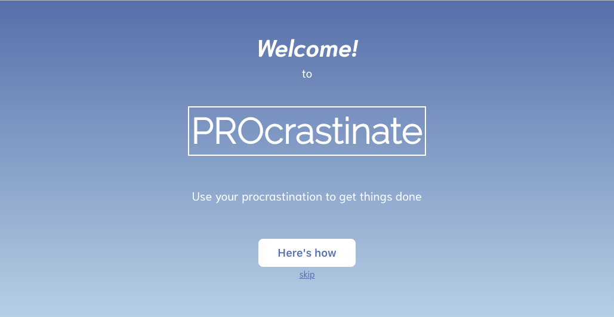
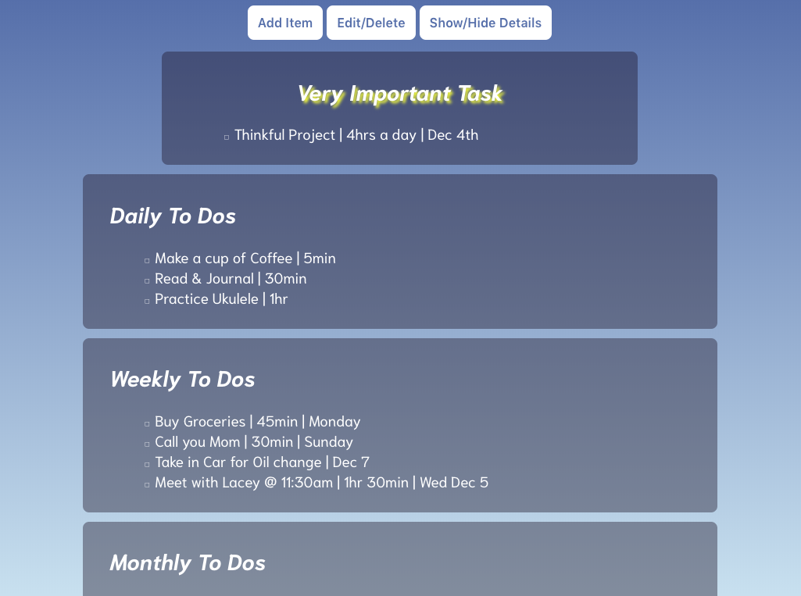

<h1>PROcrastinate</h1>
<p><a href="https://tealog.herokuapp.com/">PROcrastinate</a> is a responsive full-stack app that allows users to tackle their to do lists in a more effective way.</p>



## Getting started
### Installing
```
>   git clone https://github.com/marissafaulkner/PROcrastinate
>   cd PROcrastinate
>   npm install
```
### Launching
```
>   npm start
```
Then open [`localhost:8080`](http://localhost:8080) in a browser.

<h2>Introduction</h2>
<p>As a practiced procrastinator, I've always found that to do lists are a nesseccary part</p>

<h2>Tech Stack</h2>
<ul>
  <li>HTML</li>
  <li>CSS</li>
  <li>JavaScript</li>
  <li>jQuery</li>
  <li>Node.js</li>
  <li>Mongo DB</li>
</ul>

<h2>Responsive</h3>
<ul>
  <li>The app is fully responsive and quickly adapts to all mobile, tablet, and desktop viewports.</li>
</ul>
